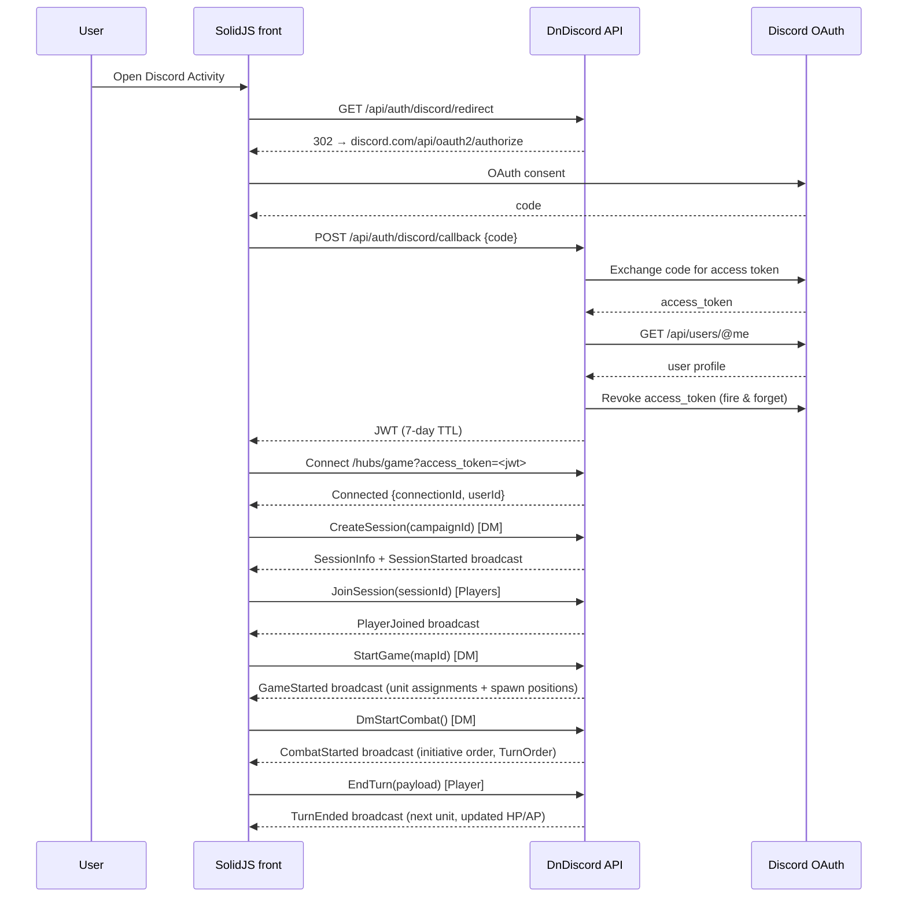
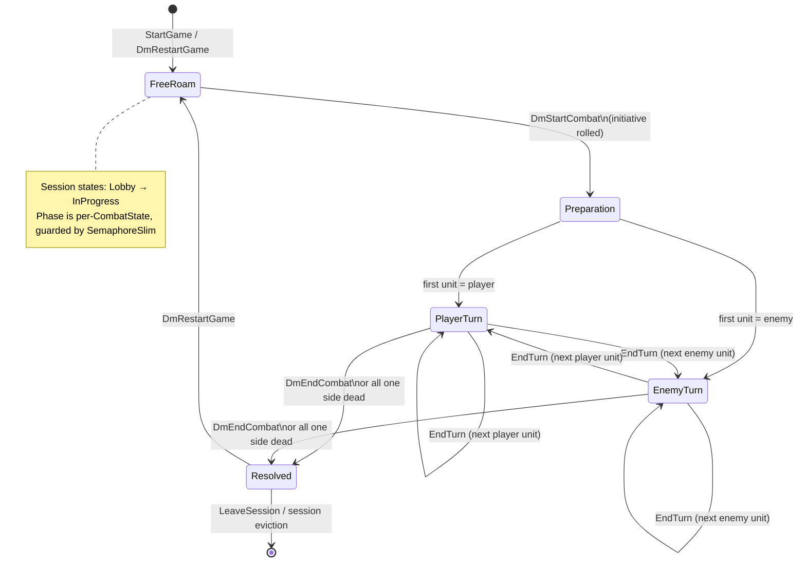

# DnDiscord — Backend

.NET 9 backend for **DnDiscord**, a D&D campaign manager built as a [Discord Activity](https://discord.com/developers/docs/activities/overview). It exposes a REST API and a SignalR hub that drive the companion front-end ([epi-esp-front](https://github.com/aCuriousDev/epi-esp-front), SolidJS). The project is a POC — substantial in scope, deliberately minimal in infrastructure overhead.

🚀 **Live deployment:** [dndiscord.cadran.app](https://dndiscord.cadran.app/)

---

## Architecture overview

```mermaid
graph TD
    subgraph Client
        Front[SolidJS Activity\nepi-esp-front]
    end

    subgraph Backend["DnDiscordAPI (.NET 9)"]
        Program[Program.cs\nComposition root]

        subgraph Modules
            Auth[Auth module\nDiscord OAuth · JWT\nRGPD endpoints]
            Campaign[Campaign module\nCRUD · Members\nSnapshots · Maps\nSessions · Roll history]
            Games[Games module\nCharacters · Inventory\nWallet · Progression]
            MP[Multiplayer module\nGameHub (SignalR)\nCombatManager FSM\nSessionManager]
            SD[ServiceDefaults\nSerilog · Scalar\nHealth checks]
        end

        subgraph DbContexts
            CDB[(CampaignDbContext\nDefaultConnection\nPostgreSQL)]
            GDB[(GamesDbContext\ngamesdb\nPostgreSQL)]
        end

        subgraph Adapters["Cross-module adapters (DnDiscordAPI layer)"]
            IIG[IInventoryGrantService\n→ InventoryGrantAdapter]
            ICM[ICampaignMapLookupService\n→ CampaignMapLookupAdapter]
            ICL[ICharacterLookupService\n→ CharacterLookupAdapter]
            ICP[ICharacterProgressionService\n→ CharacterProgressionAdapter]
        end
    end

    subgraph External
        PG[(PostgreSQL 16)]
        Discord[Discord OAuth API]
        Seq[Seq\nlog aggregator]
    end

    Front -- REST + JWT --> Program
    Front -- SignalR /hubs/game --> MP
    Front -- SignalR /hubs/messages --> Program

    Program --> Auth
    Program --> Campaign
    Program --> Games
    Program --> MP
    Program --> SD

    Campaign --> CDB
    Games --> GDB
    Auth --> CDB
    Auth --> GDB

    MP --> Adapters
    Adapters --> Games
    Adapters --> Campaign

    CDB --> PG
    GDB --> PG
    Auth --> Discord
    SD --> Seq
```

Each module follows the same pattern: an `Extension.cs` exposes `Add*Module()` (DI registration) and `Use*Module()` (middleware + EF migration). Migrations run at startup — no manual `dotnet ef database update` needed.

Cross-module communication from `GameHub` goes through thin interfaces (`IInventoryGrantService`, `ICampaignMapLookupService`, `ICharacterLookupService`, `ICharacterProgressionService`). Their concrete adapters live in the `DnDiscordAPI` project where both module project references are visible, avoiding circular dependencies.

---

## Modules

### Campaign

**DbContext:** `CampaignDbContext` (connection string key: `DefaultConnection`)

Manages everything campaign-scoped:

| Area | Endpoints |
|---|---|
| Campaign CRUD | `GET/POST/PUT/DELETE /api/campaigns[/{id}]` — paginated list with search/sort/filter, role-based visibility |
| Member management | `POST /api/campaigns/{id}/invite` · `POST /api/campaigns/{id}/join` · `GET /api/campaigns/{id}/members` |
| Snapshots | `GET/POST /api/campaigns/{id}/snapshots` · `GET/DELETE /api/campaigns/{id}/snapshots/{sid}` · `POST …/export` · `POST …/restore` |
| Maps | `GET/POST/PUT/DELETE /api/campaigns/{id}/maps[/{mapId}]` — jsonb `Data` blob; reads open to members, writes DM-only |
| Sessions | `POST /api/campaigns/{id}/sessions/start` · `POST …/end` · `GET …/history` |
| Roll history | `GET /api/campaigns/{id}/rolls` — paginated journal of D20 results, member-readable |

> **Note:** `CampaignController` has no `[Authorize]` attribute. Unauthenticated requests reach `UserContextService.GetCurrentUserId()` and return 500, not 401.

The DM is **not** a `CampaignMember`; they are tracked via `Campaign.DungeonMasterId`. Member count/list excludes the DM.

---

### Games

**DbContext:** `GamesDbContext` (connection string key: `gamesdb`)

Manages player-owned game data:

| Area | Endpoints |
|---|---|
| Characters | `POST /api/games/character` · `GET /api/games/character/{id}` · `GET /api/games/character/my-characters` · `PATCH …/{id}/hit-points` · `POST …/{id}/level-up` |
| Wallet | `GET/PATCH /api/games/character/{id}/wallet` — copper/silver/gold/platinum |
| Inventory | `GET /api/games/inventory/catalog` · `GET/POST /api/games/inventory/{characterId}` · `DELETE …/{characterId}/entry/{entryId}` · `POST …/use` |

Character creation requires `abilities` in the request body. Level-up and wallet endpoints are owner-only. The DM grants items to a character via the hub (`DmGrantItem`) or the REST endpoint (DM-scoped with `campaignId`).

Enums in Games DTOs serialize as strings (per-property `[JsonConverter(typeof(JsonStringEnumConverter))]`). Elsewhere enums serialize as integers.

---

### Auth

Implements the Discord OAuth2 → JWT flow plus GDPR endpoints.

| Endpoint | Description |
|---|---|
| `GET /api/auth/discord/url` | Returns the Discord OAuth authorization URL |
| `GET /api/auth/discord/redirect` | 302 redirect to Discord (for embed / CSP-constrained contexts) |
| `POST /api/auth/discord/callback` | Exchanges the auth code for a JWT; revokes the Discord access token immediately after user-data fetch |
| `GET /api/auth/me` | Returns current user from in-memory store; reconstructs from JWT claims after restart |
| `POST /api/auth/logout` | Client-side only (stateless JWT — no server-side revocation) |
| `DELETE /api/auth/me` | **GDPR art. 17** — hard deletes all personal data (characters, owned campaigns + cascades, memberships); tombstones the Discord ID; rate-limited (3 req / 10 min per user) |
| `GET /api/auth/me/export` | **GDPR art. 20** — JSON export of personal data, third-party PII pseudonymised; rate-limited (5 req / 10 min) |
| `POST /api/auth/dev/login` | Dev-only (404 in production) — generates a JWT without Discord, useful for local testing |

Tombstoning: deleted accounts are recorded in the in-memory `UserStore`. A `TombstonedAccountMiddleware` rejects still-valid JWTs belonging to deleted accounts before they reach authorization. Re-authentication via Discord OAuth returns `410 Gone` for tombstoned IDs.

The user's Discord ID (a string) is mapped to a deterministic `Guid` via MD5 (`DiscordIdMapping.ToGuid`) for use as primary key material in EF entities.

---

### Multiplayer

SignalR hub (`GameHub`) at `/hubs/game`. Server-authoritative: the hub owns all combat state transitions; clients send intents, not state.

**Session lifecycle hub methods:**

| Method | Who | Description |
|---|---|---|
| `CreateSession(campaignId, guildId?, voiceChannelId?)` | DM | Creates a session tied to a campaign; broadcasts `SessionStarted` / `ActivitySessionStarted` |
| `JoinSession(sessionId)` | Player | Joins by session ID or join code; broadcasts `PlayerJoined` |
| `RejoinSession()` | Any | Explicit reconnect — sends snapshot of current map + combat state to caller |
| `LeaveSession()` | Any | DM leaving ends the session for all (`SessionEnded`); player leaving broadcasts `PlayerLeft` |
| `KickPlayer(targetUserId)` | DM | Removes a player; broadcasts `PlayerKicked` |
| `SelectCharacter(characterId?)` | Player | Links a persisted character to the player's slot |
| `SelectDefaultTemplate(templateId?)` | Player | Picks a quickstart preset (`warrior` / `mage` / `archer`) without a DB character |
| `SubscribeCampaign(campaignId)` | Any | Subscribes to campaign-scoped notifications (e.g. `SessionStarted`) |

**DM tools hub methods:**

| Method | Description |
|---|---|
| `StartGame(mapId, mapData?)` | Locks in unit assignments and broadcasts `GameStarted` to all players with server-computed spawn positions |
| `DmRestartGame(mapId, mapData?)` | Same as `StartGame` but allowed when session is already `InProgress` |
| `DmStartCombat()` | Rolls initiative, advances phase to `PlayerTurn` / `EnemyTurn`, broadcasts `CombatStarted` |
| `DmEndCombat()` | Resolves combat with a specified outcome; resets phase to `FreeRoam` |
| `DmAdjustHp(unitId, delta)` | Adjusts a unit's current HP; auto-ends combat when one side is wiped |
| `DmMoveToken(payload)` | Teleports a token to a new position; broadcasts `UnitMoved` |
| `DmSwitchMap(mapId)` | Loads a campaign map from DB and broadcasts `MapSwitched` with full map data |
| `DmGrantItem(payload)` | Awards an inventory item to a character; broadcasts `InventoryItemGranted` to the session |
| `DmAwardExperience(payload)` | Grants XP; triggers automatic level-up if threshold is crossed, broadcasts `CharacterProgressed` |
| `DmForceLevelUp(payload)` | Forces a level-up regardless of XP; also applies ASI if pending |
| `DmGrantGold(payload)` | Adjusts a character's wallet; broadcasts `GoldGranted` |
| `DmSpawnUnit(payload)` | Spawns an enemy or ally unit on the board |
| `DmRequestRoll(payload)` | Requests a D20 roll from specific players; server records results, broadcasts to DM as they come in |
| `DmCancelRollRequest(requestId)` | Cancels a pending roll request; clears pending state for targeted players |
| `DmHiddenRoll(diceType, modifier?, label?)` | Server-side private roll for the DM, result returned only to caller |

**Player hub methods:**

| Method | Description |
|---|---|
| `EndTurn(payload)` | Submits movement and AP spend for the current turn; server advances to next unit |
| `SendUnitMove(payload)` | Broadcasts a token movement to the session group |
| `SendAbilityUsed(payload)` | Broadcasts ability usage (AP cost, cooldown) |
| `SubmitRollResult(payload)` | Submits the result for a `DmRequestRoll`; server records and broadcasts to DM |
| `RequestRollReplay()` | Re-delivers any in-flight roll requests to a reconnecting client |

---

## Auth and session flow



---

## Combat state machine



Combat state lives in `CombatState` (in-memory, per session). All mutations go through `CombatManager`; the hub layer never writes `CombatState` fields directly. A `SemaphoreSlim` serializes concurrent hub invocations.

---

## Local development setup

### 1. PostgreSQL

```sh
docker run -d \
  --name dndiscordPostgresDebug \
  -e POSTGRES_USER=DnDiscord \
  -e POSTGRES_PASSWORD=DnDiscordSecured \
  -e POSTGRES_DB=DnDiscordDB \
  -e PGDATA=/data/postgres \
  -v local_pgdata:/data/postgres \
  -p 5432:5432 \
  postgres:16
```

### 2. Seq (structured log UI)

```sh
docker run --name seq -d --restart unless-stopped \
  -e ACCEPT_EULA=Y \
  -e SEQ_FIRSTRUN_ADMINPASSWORD=secured \
  -v seqdata:/data \
  -p 5341:80 \
  --network=seq-net \
  datalust/seq
```

Seq UI: `http://localhost:5341`

### 3. Discord OAuth secrets

Secrets are stored as **persistent Windows user-level environment variables** — not in `appsettings.json`, not in `dotnet user-secrets`. The double underscore maps to .NET's `Discord:ClientId` configuration key.

```powershell
# One-time setup — survives reboots, per-user, registry-backed
[Environment]::SetEnvironmentVariable('Discord__ClientId',     '<your-client-id>',  'User')
[Environment]::SetEnvironmentVariable('Discord__ClientSecret', '<your-secret>',     'User')
[Environment]::SetEnvironmentVariable('Discord__RedirectUri',  'http://localhost:3000/auth/callback', 'User')
```

New terminals pick them up automatically. Mirror into the current session if needed:

```powershell
$env:Discord__ClientId     = [Environment]::GetEnvironmentVariable('Discord__ClientId',     'User')
$env:Discord__ClientSecret = [Environment]::GetEnvironmentVariable('Discord__ClientSecret', 'User')
$env:Discord__RedirectUri  = [Environment]::GetEnvironmentVariable('Discord__RedirectUri',  'User')
```

### 4. Port alignment

`launchSettings.json` defaults to `5261`; the front expects `5054`. Override once:

```powershell
[Environment]::SetEnvironmentVariable('ASPNETCORE_URLS', 'http://localhost:5054', 'User')
```

### 5. Run

```sh
dotnet run --project src/DnDiscordAPI/DnDiscordAPI.csproj
```

API docs (Scalar): `http://localhost:5054/scalar/v1`
Health check: `http://localhost:5054/api/health`

---

## Build and test

```sh
dotnet build
dotnet test        # requires Docker — Testcontainers spins up PostgreSQL 16
```

### Test strategy

The suite lives in `test/DnDiscordAPI.Tests/` and is organized as a four-tier pyramid:

```
                    ┌──────────────────┐
                    │   E2E workflow   │   ← 1 chained scenario
                    │   create → invite → join → snapshot → export → restore
                    ├──────────────────┤
                    │   Smoke tests    │   ← every endpoint responds (no 500s)
                    ├──────────────────┤
                    │   Integration    │   ← Testcontainers + WebApplicationFactory
                    │   ~13 fixtures   │     (Postgres 16, real EF, real HTTP)
                    ├──────────────────┤
                    │   Pure unit      │   ← no Docker, no DB, no HTTP
                    │   validators · serializers · token service · progression
                    └──────────────────┘
```

### Tooling

- **`Testcontainers.PostgreSql`** — spins up PostgreSQL 16 per test collection (not per test) — Docker required.
- **`WebApplicationFactory<TEntryPoint>`** — host the API in-process, swap DbContext registrations to point at the Testcontainer.
- **`IntegrationFixture<TEntryPoint>`** — base class that wires up the container + factory + helpers (`CreateAuthenticatedClient`, `CreateClient`).
- **`TestAuthHandler`** — fakes Discord JWT auth via the `X-Test-UserId` header so tests can assume a user identity without touching Discord.
- **`xUnit` collections** — tests are **not parallelized** (`DisableParallelization = true`) since they share the Postgres container.

### Coverage areas

| Layer | Coverage |
|---|---|
| **Unit — validators** | `CampaignValidator`, `SnapshotValidator` — happy-path + boundary errors |
| **Unit — serializers** | `SnapshotSerializer` — round-trip, schema versioning |
| **Unit — security** | `TokenService` — JWT issuance, claim shape, expiration |
| **Unit — progression** | `CharacterProgressionAdapter` — XP curves, level-up, ASI idempotency, transactional rollback |
| **Unit — combat** | `CombatManager`, scripted full-combat scenarios, `TurnManager`, deterministic `SpawnPlacementService` (FNV-1a seeded), `PendingRollRequest` lifecycle |
| **Unit — sessions** | `SessionManager` (RemoveSession side-effects, sequence-state cleanup) |
| **Unit — DTOs** | `CurrencyType` JSON serialization parity |
| **Integration — Campaign** | CRUD + auth gates + members + sessions + snapshot creation/restoration/export-import/validation + maps |
| **Integration — Character** | CRUD, level-up + ASI, wallet ownership |
| **Integration — Inventory** | DM auth, catalog, persistence |
| **Integration — Auth** | RGPD delete + export, tombstone re-auth |
| **Integration — Smoke** | Every controller endpoint responds without 500 |
| **Integration — E2E** | Full workflow: create campaign → invite → join → snapshot → export → restore |

### What is NOT covered

- **SignalR hub end-to-end** — `GameHub` is exercised through unit tests on the underlying services (`CombatManager`, `SessionManager`, `SpawnPlacementService`); the hub layer itself is tested manually against the front-end.
- **Discord OAuth callback** — the `POST /api/auth/discord/callback` exchange is mocked at the boundary (we do not call discord.com from CI). Use `POST /api/auth/dev/login` for local end-to-end auth flow tests.

### Running subsets

Pure unit tests (no Docker — fastest feedback loop):

```sh
dotnet test --filter "FullyQualifiedName~Unit|FullyQualifiedName~Utils"
```

Integration only (Docker required):

```sh
dotnet test --filter "FullyQualifiedName~Integration"
```

Note: pure unit tests live under both `test/DnDiscordAPI.Tests/Unit/` (game/multiplayer logic) and `test/DnDiscordAPI.Tests/Utils/` (validators, serializers, token service) — the filter above covers both.

---

## Docker

Copy `.env.example` to `.env` and fill in the required secrets (see the file for all keys), then:

```sh
docker compose up
```

The compose stack includes PostgreSQL 16 (port `5433`) and the application service (port `5054`). The `seq-net` network must exist externally if you want logs to reach Seq (`docker network create seq-net`).

Required env vars — the compose file will refuse to start if they are unset:

| Variable | Required |
|---|---|
| `JWT_SECRET_KEY` | yes |
| `DISCORD_CLIENT_ID` | yes |
| `DISCORD_CLIENT_SECRET` | yes |
| `DISCORD_REDIRECT_URI` | no (defaults to `http://localhost:3000/auth/callback`) |

---

## CI/CD

### CI — `.github/workflows/ci.yml`

Triggered on every push and pull request to `main` and `dev`. Pipeline stages run sequentially; any failure blocks the merge.

```
┌──────────────┐  ┌──────────────┐  ┌─────────────────┐  ┌──────────────────┐  ┌────────────────┐
│  Restore +   │→ │  Build +     │→ │  EF migration   │→ │  Production      │→ │   Status check │
│  test        │  │  unit/int    │  │  drift check    │  │  image build     │  │   (required)   │
│  (Docker)    │  │  via xUnit   │  │  (both DbCtxs)  │  │  Services.Dock…  │  │                │
└──────────────┘  └──────────────┘  └─────────────────┘  └──────────────────┘  └────────────────┘
```

1. **Restore + build + test** — `dotnet restore`, `dotnet build`, `dotnet test`. Tests run against a Testcontainers Postgres on the GitHub runner (Docker is preinstalled on `ubuntu-latest`).
2. **EF migration drift check** — `dotnet ef migrations has-pending-model-changes` for both `CampaignDbContext` and `GamesDbContext`. Migrations run at startup in production, so an undetected drift would crash the boot. Catching it in CI means a broken migration never reaches Dokploy.
3. **Production Docker image build** — multi-stage build of `Services.Dockerfile`. Validates the published binary, asset paths, and runtime image without spinning up the container.

A required status check (`build-and-test`) must pass before any PR can merge into `main` or `dev` — enforced by the repo's branch protection rulesets.

### CD — Dokploy

Push to a branch configured in Dokploy (typically `main`) triggers an auto-deploy via a GitHub App webhook. Dokploy pulls the image build steps from `Services.Dockerfile`, applies environment variables from its UI vault, and rolls out a new container behind the production reverse proxy.

EF migrations apply at boot, **not** during the build. A bad migration surfaces as a startup failure on the new container; the previous container remains running until the new one passes its health check (`/api/health`).

### Observability

- **Seq** — Serilog ships structured logs to a Seq instance reachable on the `seq-net` Docker network. Local dev uses the one-liner above; production deploys point Serilog at the deployed Seq URL via the `Seq` configuration key.
- **`/api/dev/log`** — a Dev-only bridge endpoint that the front-end's `devLogBridge` posts to so `console.*` from the browser shows up alongside server logs in Seq during local debugging. Disabled outside the Development environment.

---

## Conventions

- **POC scope** — keep things minimal; no over-engineering.
- **PRs target `dev`**; merging `dev → main` triggers a production deploy.
- **Commits** — no `Co-Authored-By` or AI attribution lines.
- **Migrations run at startup** — never run `dotnet ef database update` manually; add a migration and let the app apply it on next boot.
- **DM identity** — the DM is not a `CampaignMember`; they are tracked via `Campaign.DungeonMasterId`. This distinction matters in member counts, invite flows, and hub role checks.

---

## Companion repository

[epi-esp-front](https://github.com/aCuriousDev/epi-esp-front) — SolidJS Discord Activity client.
